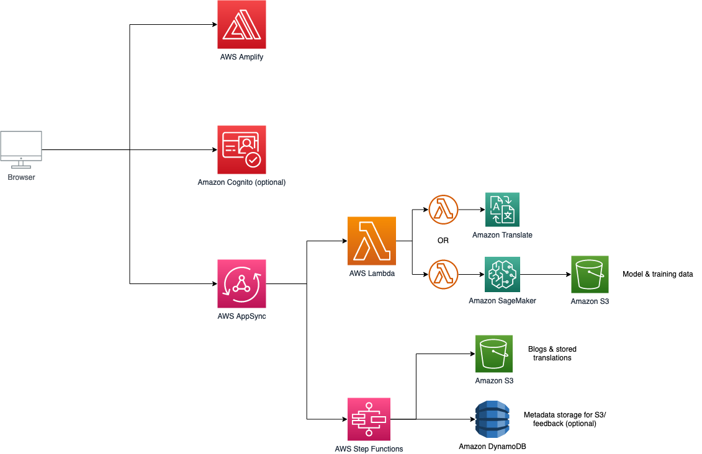

# AWSome-NLP

This full stack application was made to translate English AWS blog posts into low-resource languages in order to improve the language accessibility for people who may not have access to good translation services.

## Translation models

This application uses Amazon Translate and our own, fine tuned Transformer based model hosted on AWS SageMaker in order to translate the blogposts. (Note that the SageMaker model currently only translates the blog posts into Turkish but this can be extended into other languages).

## Services

In order to build this application we use the following AWS services:

- Amazon Translate to translate blog posts
- AWS Amplify to host and deploy our application
- AWS Lambda to build logic (for example to scrape the blog posts and save them)
- DynamoDB to store translations and ratings for those translations so that it acts as a cache
- AWS Step Functions for control flow within the application
- AWS AppSync for GraphQL queries and to facilitate communication between different services
- AWS S3 to store translations
- AWS CloudSync for frontend aesthetics

## Tools

The tools that we use in order to build this application are:

- React for the frontend (which can be started by running ```$ npm install & npm start```)
- AWS Lambda for logic (which can be found on the AWS Console and run using the provided test templates)

## Project Architecture
Below is a diagram of the project architecture:


## Subdirectories

This Project has many moving parts and therefore has READMEs in each subdirectory.
Below is a brief description of each subdirectory:

- [Frontend](src/README.md): This is the React frontend for the application.
- [Checking URL](amplify/backend/function/checkingUrl): This is the AWS Lambda function that checks if the URL is valid.
- [Get Blog Content](amplify/backend/function/getBlogContent): This is the AWS Lambda function that scrapes the blog content from the AWS blog.
- [Step Function Invoker](amplify/backend/function/stepFunctionInvoker): This is the AWS Lambda function that invokes the AWS Step Function.
- [Storing Translation](amplify/backend/function/storingTranslation): This is the AWS Lambda function that stores the translation in DynamoDB.
- [User Config Function](amplify/backend/function/UserConfigFunction): This is the AWS Lambda function processes the user's configuration and queries the Translation.
- [CDK Infrastructure as Code](cdk-init-ts/): This is code that creates all of the infrastucture for the application.
 