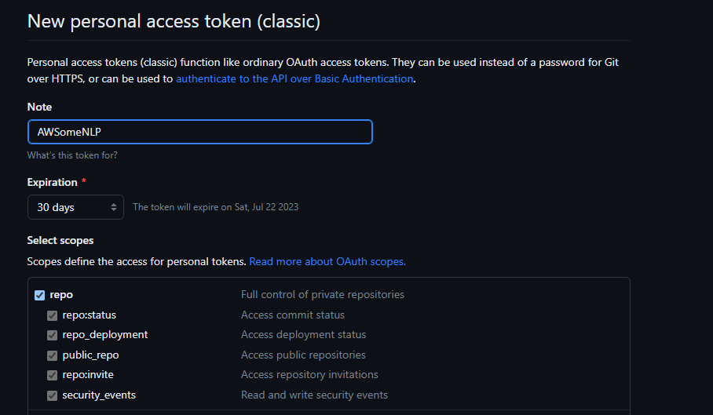

# Infrastructure as Code

This code serves to be able to remake all of the AWS resources this project requires from scratch. 

## Set-up

This project assumes you have an AWS account and a working instance of the AWS CLI, otherwise, otherwise refer to [this guide](https://docs.aws.amazon.com/cli/latest/userguide/cli-chap-configure.html). Furthermore, ensure your AWS account has access to IAM roles and Secrets.

Furthermore, you need to have Java **17** installed and as the active version (run `java -version` to ensure this is the case), and Gradle 8.x (run `gradle -version` to ensure).

### Github
1. Fork this Repository
   - In order to be able to put this onto your AWS account, webhooks will be made, which means you need to be the owner of the repository you plan on using.

2. Create a new Personal Access Token (classic)
   - On the Github website, [create a new personal access token](https://www.theserverside.com/blog/Coffee-Talk-Java-News-Stories-and-Opinions/How-to-create-a-GitHub-Personal-Access-Token-example) with at least repo level access. . Save this key, as it will be used in the next step.

### AWS Secrets Manager
1. Open AWS Secrets Manager and [create a Plaintext secret for your token](https://docs.aws.amazon.com/secretsmanager/latest/userguide/create_secret.html). Give the secret the name **oauthkey** for simplicity.


2. Finish the storing procedure, leaving every setting as default.

### Locally
1. Navigate to the [source directory](lib/)

2. In `exports.ts`, change the `owner` field to your Github name, the `repository` field to the repo name, and the `keyname` to what you stored your AWS secret as (should be **oauthkey**).

3. Run these commands:

```$ ./buildall.sh``` to build all of the Lambda Functions
**Note** If you are running this on a Unix based based system, there may be an extra carriage return, in the bash scripts, so install the dos2unix tool and then run ```$ ./dos2unix.sh```. It should work afterwards.
```$ cdk synth``` to synthesize the CloudFormation template
```$ cdk bootstrap``` to provision to the resources
```$ cdk deploy``` to deploy the resources


